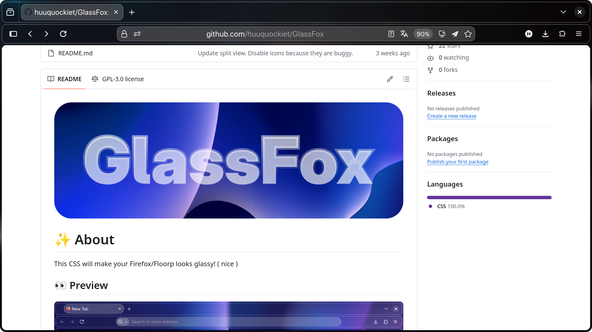
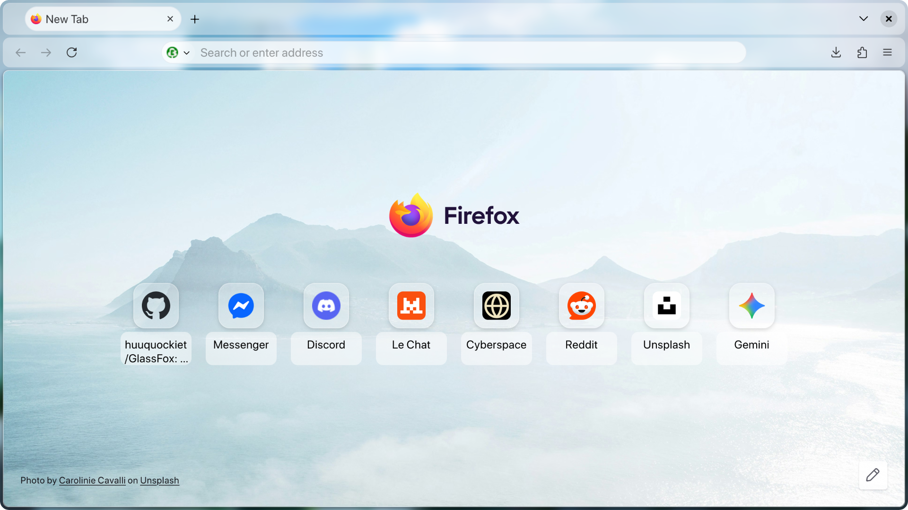

# ✨ About
This CSS will make your Firefox/Floorp looks glassy! ( nice )

## 👀 Preview

> [!WARNING]
> This theme is very dependant on your wallpaper
> Your wallpaper will decide the contrast of the theme
> I can reduce the transparency level, but I don't want to. I found it lost the glassy feel.
> If you really like your wallpaper, I will have a low transaparency option in the post-config.

## 🔧 How to setup

### Step 1: Enable CSS Support and theme
1. Go to `about:config`.
2. Search for `toolkit.legacyUserProfileCustomizations.stylesheets`.
3. Set it to true ( click the arrow button )
4. Search for `glass.colors` 
5. Choose `string`. Click the + button to create the config. Then, choose a color! List: `red, orange, yellow, purple, violet, pink, blue, cyan, green, gray` ( all **lowercase** !!)
> You can freely change the colors at any time.
6. `glass.darkMode`, boolean, on or off, your choice. 
7. `glass.lowTrans`, boolean, on or off, your choice. 
8. Install Firefox Color and use this [theme](https://color.firefox.com/?theme=XQAAAAImAQAAAAAAAABBKYhm849SCia3ftKEGccwS-xMDPrv2Sw6Caq-qy5QgqeHG4K15QeDoRokmgjiM6AAxM3X9F70ZoGsfXBn8NHNS5chMvkRB4ubMyj96LOtIiijIsgivikShXIJBiNLhibBR-iNGmJEyvv6GxT3L8ZfZ44U7SMuqRU34nmT2wH0zXB7cYRhxWi9IXLqUA_QfQAjOd6C4Ce-9yfJm6ratFBHYVIYP_6fLRM) for dark mode and [this one](https://color.firefox.com/?theme=XQAAAAInAQAAAAAAAABBKYhm849SCia3ftKEGccwS-xMDPrv2Sw6Caq-qy5QgqeHG4JSUNM3DE0u1ufy-ZPZTrYFbN6uJgAnKqeu0iInXtk311GfWzucR-ONtBKGWoKxWFYNoX6sXh8KiCOLRwhQta7DtEoJ9pfUkmdlW1h-ipBavVuln7OkyTYmpA_fNbPbqAoMJmepm_IGnyVQOZJjvIKPuyYUCIlmqZy9SCmvG24fXCYw_3__adCxAA) for light mode.
9. If you are using Floorp, please use Proton tab style.

> I wanted to simplify this step, but limited skills, so sorry :)

### Note
- If you are using Windows 10, install [DWMBlurGlass](https://github.com/Maplespe/DWMBlurGlass) for effects
- If you are using Windows 11, enable `widget.windows.mica`.
- Linux transparency + blur should be handled by your WM.
- Untested on macOS.

### Step 2: Install the files
1. See the green `Code` button up there? Click it :)
2. Choose `Download ZIP`.
3. Unzip.

### Step 3: Open your profile folder and copy `chrome`
1. Go to `about:support`.
2. Find `Profile Directory` or `Profile Folder`
3. Open it.
4. Copy the `chrome` folder to your profile folder. Now, restart Firefox/Floorp and you are set!

 
 

## ⚙️ Post-setup configs 

> [!WARNING]
> `glass.colors`, `glass.darkMode` and `glass.lowTrans` are required for the theme to work properly 

| Name                       | Type    | Value                                                              |
|----------------------------|---------|--------------------------------------------------------------------|
| glass.tab.inactiveBG       | boolean | true/false                                                         |
| glass.colors               | string  | red, orange, yellow, purple, violet, pink, blue, cyan, green, gray |
| glass.navBar.colorInButton | boolean | true/false                                                         |
| glass.darkMode             | boolean | true/false                                                         |
| glass.lowTrans             | boolean | true/false                                                         |

> Just try them.

 
 
 
 
 

### PS: Hey, you can add an `background.jpg` to the chrome folder for a custom background!
